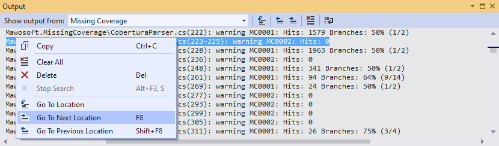
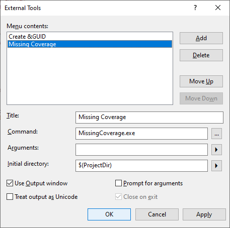

# Missing Coverage
### Easily navigate to the blind spots of your unit testing in Visual Studio.

*Missing Coverage* filters the reports generated by your primary coverage tools like [Coverlet](https://github.com/coverlet-coverage/coverlet), [Fine Code Coverage](https://github.com/FortuneN/FineCodeCoverage), or [ReportGenerator](https://github.com/danielpalme/ReportGenerator) for missing line and branch coverage and outputs the results in a format that allows for easy navigation to the code in question via the *Visual Studio* Output Tool Window.



### To use Missing Coverage
- Make sure the coverage reports are available in *Cobertura* format.
- Add *Missing Coverage* as an external tool to *Visual Studio*.



- Don't forget to check *Use Output Window* and - depending on your preferences - choose either `$(ProjectDir)` or `$(SolutionDir)` as *Initial directory*.
- If the file names of your reports don't match the default pattern (see below), you can customize it via *Arguments*.
- There are also a variety of options you can enter into *Arguments* which let you further tweak the results according to your needs.

### Command line arguments
```
Usage: MissingCoverage [options] [filespecs]

Options:
  -h|--help                            Display this help.
  -ht|--hit-threshold <INTEGER>        Lowest # of line hits to consider a line as covered, i.e. to not include it as missing coverage in report.
  -ct|--coverage-threshold <INTEGER>   Lowest coverage in percent to consider a line with branches as covered.
  -bt|--branch-threshold <INTEGER>     Minimum # of total branches a line must have before the coverage threshold gets applied.
  -lo|--latest-only                    For each source file, uses only the data from the newest of all matching report files.
  --                                   Indicates that any subsequent arguments are filespecs, even if starting with hyphen (-).

Filespecs:
  Any number of space separated file specs. Wildcards * ? ** are supported.
  Absolute or relative paths can be used. Relative paths are based on the current directory.

Default:
  MissingCoverage --hit-threshold 1 --coverage-threshold 100 --branch-threshold 2 **\*cobertura*.xml

Examples:
  C:\MyProjects\**\*cobertura*.xml                     Process all xml files with name containing 'cobertura' recursively in all subdirectories of 'C:\MyProjects'.
  --latest-only TestResults\*\coverage.cobertura.xml   Process only the newest report in the randomly named subdirectories of 'TestResults' in the current directory.
  -hit-threshold 0                                     Report only lines with incomplete branch coverage, ignore lines that don't contain branches.
```
